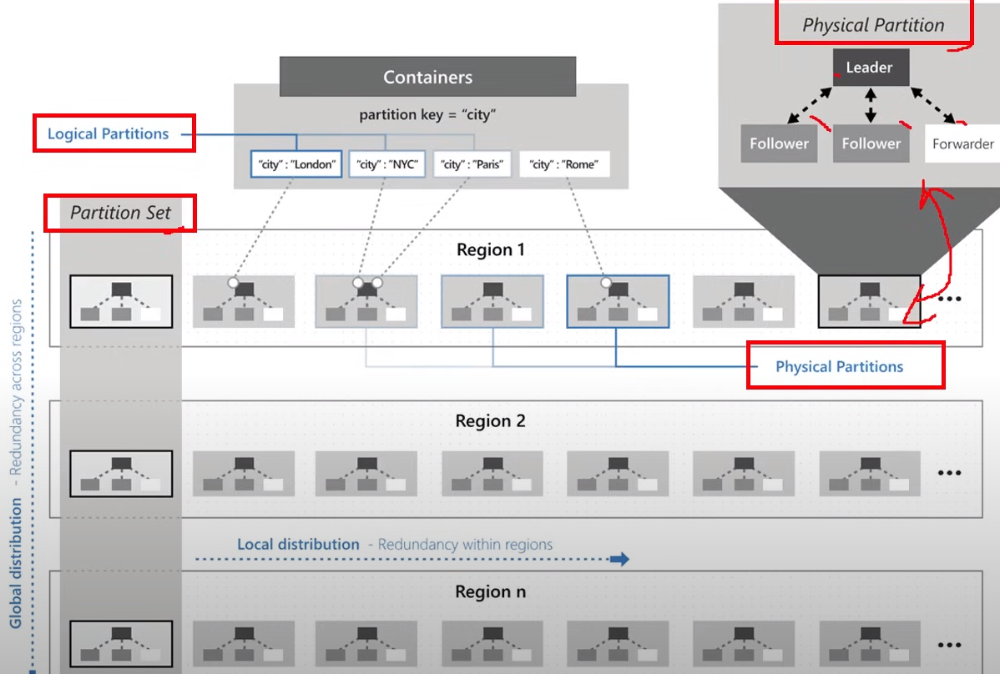
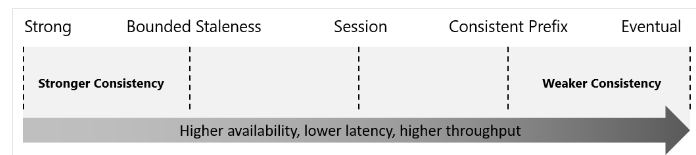
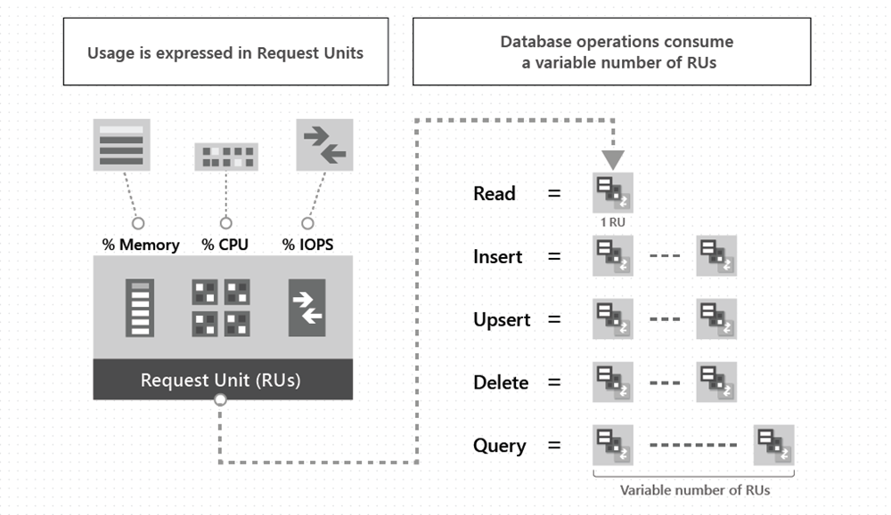

# Identify key benefits of Azure Cosmos DB
- NoSQL database
- provides:
  - low latency
  - elastic scalability of throughput
  - well-defined semantics for data consistency
  - high availability

### Key benefits of global distribution
- It uses the multi-master replication protocol. With it every region supports both writes and reads.
- It also enables:
  - Unlimited elastic write and read scalability.
  - 99.999% read and write availability all around the world.
  - Guaranteed reads and writes served in less than 10 milliseconds at the 99th percentile.

# Explore the resource hierarchy
- Azure Cosmos DB account can be managed by Portal, CLI and SDKs.
- You can create max 50 Cosmos DB accounts under a subscription.
- Elements in an Azure Cosmos DB account:

- *Containers and Scaling*
   - Containers: In Azure Cosmos DB, a container is the unit where data is stored.
   - Scaling: Unlike relational databases that scale up by increasing VM size, Azure Cosmos DB scales out by distributing data across multiple partitions.
- *Partitioning Concepts*
  - Physical Partitions: The underlying storage units that:
    - Can store up to 50 GB of data each.
    - Provide up to 10,000 Request Units (RU/s) of throughput.
  - Logical Partitions: Logical grouping within a container, identified by the partition key, with a size limit of 20 GB per partition.
- *Partition Key*
  - Purpose: Used to distribute data efficiently across physical partitions.
  - Keys used to group items, kinda like primary keys
  - Significance in Queries:
    - Enables efficient data retrieval by using the partition key in the WHERE clause.
    - Azure Cosmos DB uses it to route operations (e.g., read, write, update) to the correct partition.
- *Storage and Throughput*
  - Storage and throughput scale automatically:
    - New partitions are created as storage increases.
    - Throughput can be increased manually or dynamically, providing virtually unlimited scalability.

 

- When you create a container, you configure throughput in one of the following modes:
  - `Dedicated throughput`: Throughput is only for that container. 2 Types of dedicated throughput: standard and autoscale.
  - `Shared throughput`: Throughput is specified at the database level and then shared with up to 25 containers within the database. 
     Sharing of throughput excludes containers that are configured with their own dedicated throughput.

### Cosmos DB items

# Consistency levels

# Choose the right consistency level
1. Strong Consistency
   - Guarantees linearizability (operations are served in order).
   - Always returns the most recent committed version of item.
   - No uncommitted or partial writes are visible to the client.
   - Users are guaranteed to read the latest commited write.
2. Bounded Staleness Consistency
   - Guarantees data lag is less than:
     - K versions (updates), or
     - T time intervals (whichever comes first).
   - Ideal for multi-region reads with predictable lag.
   - Writes are throttled if the lag exceeds the configured limits.
   - Provides strong guarantees for single-region writes with multiple regions.
3. Session Consistency
   - Ensures:
     - Read-your-writes: You can always read what you wrote within the session.
     - Write-follows-read: Writes respect the order of previous reads in the session.
   - Guarantees are per session, useful for single client sessions or shared session tokens.
   - Weaker than Strong Consistency but efficient for most applications.
4. Consistent Prefix Consistency
   - Ensures updates are read in the order they were written.
   - Writes in a transaction are always read together.
   - Example: If you write two updates (Doc1 v1, Doc2 v1 and Doc1 v2, Doc2 v2), you'll never see a mixed state (e.g., Doc1 v1 with Doc2 v2).
5. Eventual Consistency
   - No guarantees on read order or the latest data.
   - Eventually, all replicas converge to the same state.
   - Weakest consistency, but fastest and most scalable.
   - Best for scenarios like counting likes, retweets, or non-critical data.

# Supported APIs
- Cosmos DB provides 2 types of API to interact:
  - `NoSQL` (Native API, best for Cosmos DB)
  - `API for Other databases` (using Wire Protocol Implementation)
    - These APIs are best suited if the following conditions are true:
      - If you have existing MongoDB, PostgreSQL Cassandra, or Gremlin applications
      - If you don't want to rewrite your entire data access layer
      - If you want to use the open-source developer ecosystem, client-drivers, expertise, and resources for your database

- `NoSQL`:
  - Stores data in document format
  - full control over interface, service, SDK client library
  - will be the first to get the newest features.
  - Support SQL syntax
- `MongoDB`:
  - Stores data in document structure via BSON format
  - Compatible with MongoDB wire protocol(works with Mongo client drivers and tools)
  - It does not use any native MongoDB related code
- `PostgreSQL`:
  - Stores data in single node or distributed in a multi-node
- `Apache Cassandra`:
  - Stores data in column-oriented schema. Ideal for large-scale distributed databases
  - Horizontal scaling to handle large volumes of data across multiple nodes
  - Compatible with Cassandra Wire protocol
- `Apache Gremlin`:
  - Allows users to make graph queries and stores data as edges and vertices
  - Use the API for Gremlin for scenarios:
    - Involving dynamic data
    - Involving data with complex relations
    - Involving data that is too complex to be modeled with relational databases
    - If you want to use the existing Gremlin ecosystem and skills
- `API for Table`
  - Stores data in key/value format

# Requests Units
- You are billed for throughput (RU/s) and storage
- `RU`: cost for operations like reads,writes, queries....
  - Cost for Read: 1KB item = 1 RU
  

3 Azure Cosmos DB account modes:
- `Provisioned throughput mode`
  - You provision RUs for your database or container
  - Scale by increments of 100 RUs/s
  - You can adjust throughput anytime, either programmatically or through the Azure portal.
- `Serverless mode`
  - No need to provision throughput upfront.
  - You pay for RUs consumed based on actual usage.
- `Autoscale mode`
  - Throughput (RUs) scales automatically based on usage.
  - It adjusts based on demand, ensuring high performance without manual intervention.

- Summary when to choose: 
  - Steady Traffic: Use Provisioned Throughput.
  - Low or Infrequent Traffic: Use Serverless.
  - Variable or Unpredictable Traffic: Use Autoscale.