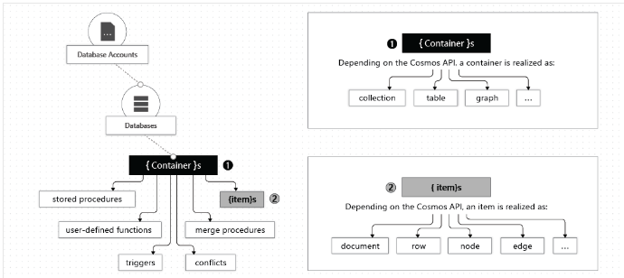
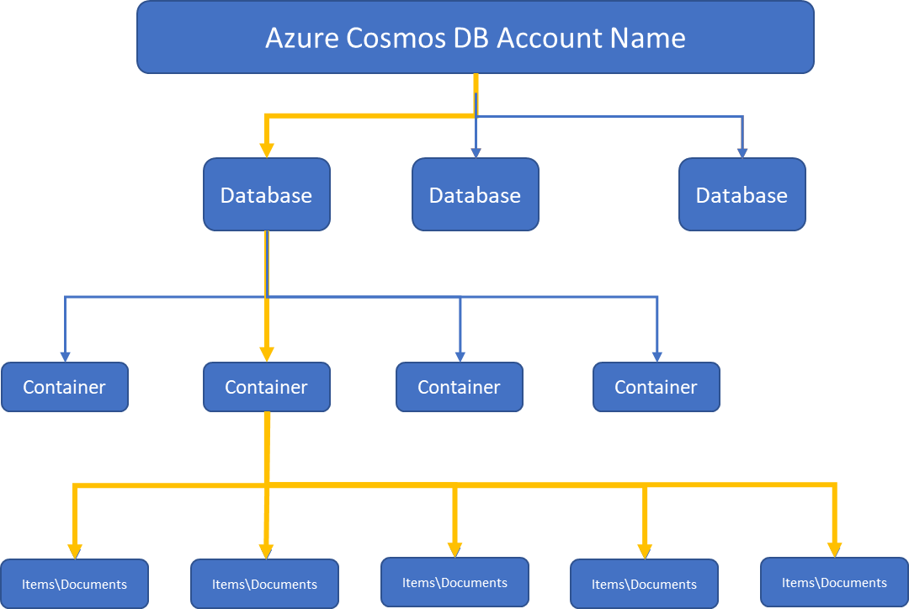
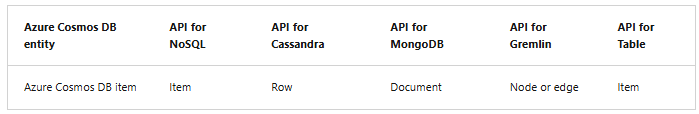

# Identify key benefits of Azure Cosmos DB
- NoSQL database
- provides:
  - low latency
  - elastic scalability of throughput
  - well-defined semantics for data consistency
  - high availability

### Key benefits of global distribution
- It uses the multi-master replication protocol. With it every region supports both writes and reads.
- It also enables:
  - Unlimited elastic write and read scalability.
  - 99.999% read and write availability all around the world.
  - Guaranteed reads and writes served in less than 10 milliseconds at the 99th percentile.

# Explore the resource hierarchy
- Azure Cosmos DB account can be managed by Portal, CLI and SDKs.
- You can create max 50 Cosmos DB accounts under a subscription.
- Elements in an Azure Cosmos DB account:

- *Containers and Scaling*
   - Containers: In Azure Cosmos DB, a container is the unit where data is stored.
   - Scaling: Unlike relational databases that scale up by increasing VM size, Azure Cosmos DB scales out by distributing data across multiple partitions.
- *Partitioning Concepts*
  - Physical Partitions: The underlying storage units that:
    - Can store up to 50 GB of data each.
    - Provide up to 10,000 Request Units (RU/s) of throughput.
  - Logical Partitions: Logical grouping within a container, identified by the partition key, with a size limit of 20 GB per partition.
- *Partition Key*
  - Purpose: Used to distribute data efficiently across physical partitions.
  - Significance in Queries:
    - Enables efficient data retrieval by using the partition key in the WHERE clause.
    - Azure Cosmos DB uses it to route operations (e.g., read, write, update) to the correct partition.
- *Storage and Throughput*
  - Storage and throughput scale automatically:
    - New partitions are created as storage increases.
    - Throughput can be increased manually or dynamically, providing virtually unlimited scalability.

 

- When you create a container, you configure throughput in one of the following modes:
  - `Dedicated throughput`: Throughput is only for that container. 2 Types of dedicated throughput: standard and autoscale.
  - `Shared throughput`: Throughput is specified at the database level and then shared with up to 25 containers within the database. 
     Sharing of throughput excludes containers that are configured with their own dedicated throughput.

### Cosmos DB items

# Consistency levels
