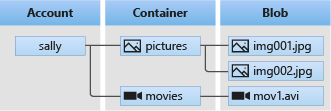
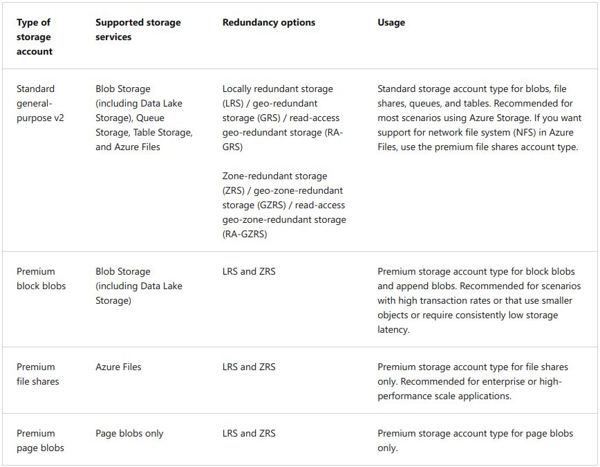
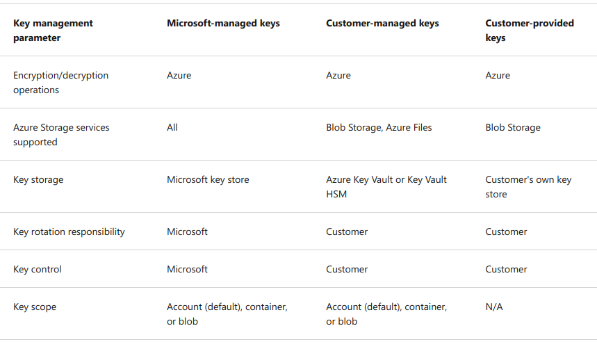

`Blob storage`: Object storage solution for the cloud
- Storing massive amounts of unstructured data
- Designed for:
  - Serving images/docs directly to browser
  - Storing files for distributed access
  - Streaming video/audio
  - Writing to log files
  - Storing data for backup and restore, disaster recovery and archiving
  - Storing data for analysis by an on-premises or Azure-hosted service.
- Can be accessed using HTTP/S.
- Objects in Blob storage are accessible via:
  - Azure Storage REST API
  - Azure Powershell
  - Azure CLI
  - Azure Storage client library

## Storage Account structure

### Storage account
- Top level container for all storage types
- Provides unique namespace for your Azure Storage data.
  - example for blob storage: `http://mystorageaccount.blob.core.windows.net`
- Types:
  - Standard
    - HDD
  - Premium
    - Increase performance using SSD
    - Has 3 account types:
      - Block blobs
      - Page blobs
      - File shares
      

### Access tiers for block blob data

|               | Hot        | Cool         | Cold         | Archive      |
|---------------|------------|--------------|--------------|--------------|
| Access rate   | Frequently | infrequently | infrequently | Almost never |
| Access cost   | Low        | Mid          | Mid-High     | High         |
| Storage cost  | High       | Mid-High     | Mid          | Low          |
| Days to store | -          | min 30       | min 90       | min 180      |

## Containers
- A directory within Storage Account
- A directory that stores blobs.
- Container naming rules:
  - 3 to 63 chars long
  - Start with letter/number. 
  - Contain only lowercase letters, numbers and dash ( - )
  - 2 consecutive dashes are not allowed. ( -- )
- Example URI: `https://myaccount.blob.core.windows.net/mycontainer`

## Blobs
- 3 Types:
  - `Block blobs`
    - Store text/binary data
    - Store up to 190.7 TiB
  - `Append blobs`
    - Optimized for append operations
    - Ideal scenario example: Logging data from VM
  - `Page blobs`
    - Store random access files up to 8 TB
    - Store virtual Hard drive (VHD) files and serve as disks for VM
- Example URI:
  - `https://myaccount.blob.core.windows.net/mycontainer/myblob`
  - `https://myaccount.blob.core.windows.net/mycontainer/myvirtualdirectory/myblob`

# Security
- Azure Storage uses service-side encryption (SSE) to encrypt your data when it's persisted to the cloud
 - Azure Storage encryption helps you with:
   - protecting your data
   - help you meet your organizational security and compliance
- Data is encrypted and decrypted using 256-bit Advanced Encryption Standard (AES)
    - It is one of the strongest block cipher
    - And is Federal Information Processing Standards (FIPS) 140-2 compliant
- Azure Storage encryption is enabled by default on all storage accounts and cannot be disabled.
- Data in storage account is encrypted with `Microsoft-managed` keys by default.
  - You can also manage encryption with your own keys. You have 2 choices:
    - `customer-managed`: used for encrypting all data in storage account
    - `customer-provided`: used during read/write and allows granular control over how blob data is encrypted/decrypted
  
    
### Client-side encryption
Both Blob Storage and Queue Storage has a client library to encrypt data on client-side.
- It has 2 versions:
  - V2: Galois/Counter Mode (GCM) mode with AES. Blob Storage and Queue Storage.
  - V1: Cipher Block Chaining (CBC) mode with AES. Blob Storage, Queue Storage, and Table Storage.
