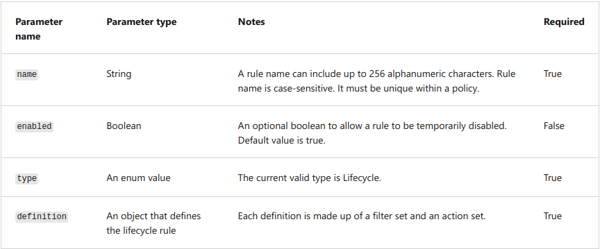
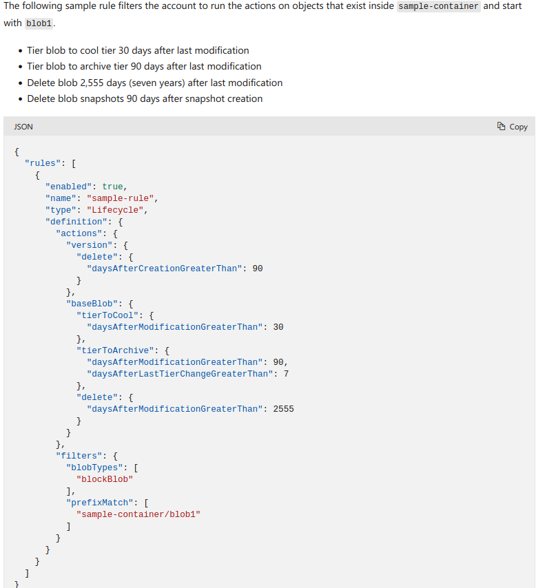
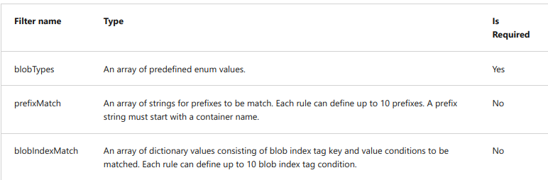
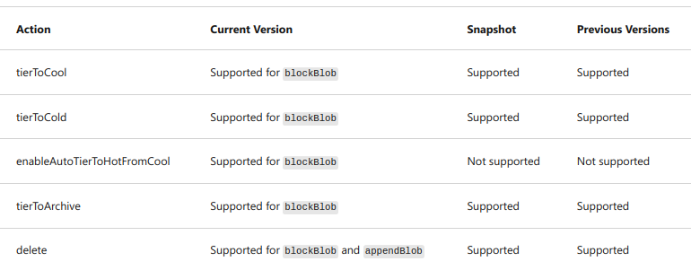
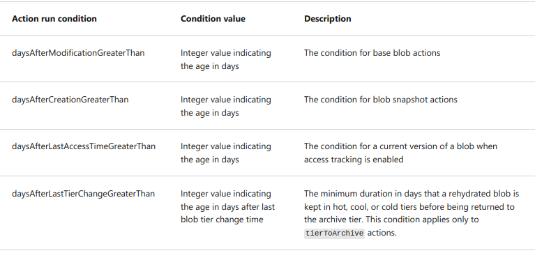

### Lifecycle management policy
With the lifecycle management policy, you can:
- Move blobs from cool to hot immediately when accessed, to optimize for performance.
- Transition current versions of a blob, previous versions of a blob, or blob snapshots to a cooler storage tier if these objects aren't accessed or modified for a period of time, to optimize for cost.
- Delete current versions of a blob, previous versions of a blob, or blob snapshots at the end of their lifecycles.
- Apply rules to an entire storage account, to select containers, or to a subset of blobs using name prefixes or blob index tags as filters.

`Lifecycle management policy`: collection of rules in a JSON document.
- Each rule includes:
  - `Filter set`: Decide which files the rule applies to, based on things like container or file names.
  - `Action set`: Decide what to do with the selected files, like moving them to a cheaper storage tier or deleting them.

`Policy`: collection of rules. (Max 100 rules in policy)

### Rule parameters

### Example: 

### Rule filters:

### Rule actions:

# Implement blob storage lifecycle policies
You can add, editor or remove a policy using:
- Azure Portal
  - Use Azure Portal Code view
  - Use Azure Portal List view
- Azure PowerShell
- Azure CLI
  - Use the command `az storage account management-policy create`
- REST APIs

# Rehydrate blob data from archive tier
- Blob in archive tier cannot be read/modified
- Rehydrate it first to online tier (hot/cool). Can take hours. Recommend to rehydrate in bulk.
- 2 options to rehydrate:
  - Copy the blob to online tier (hot/cool)
  - Change offline to online tier
    - Use `Set Blob Tier`
- The rehydration process cannot be canceled.

`rehydration priority`:
- You can prioritize the blob using:
    - `x-ms-rehydrate-priority` header
- 2 priority tier options:
  - Standard priority:
    - Access in order it was received. Might take up to 15 hours
  - High priority
    - Might complete within 1 hour for objects under 10 GB
