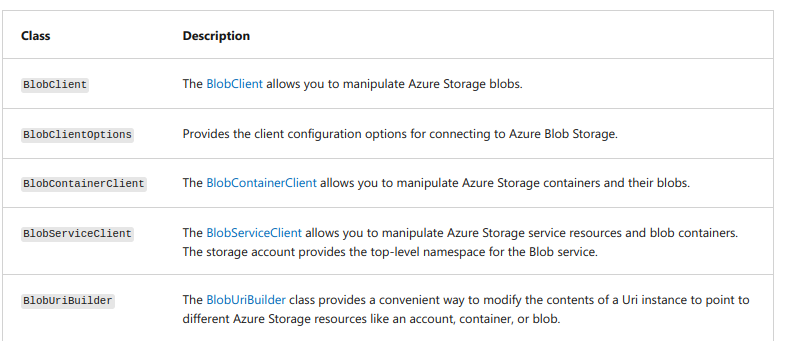
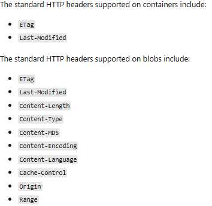

### Basic classes from client library

# Container properties and metadata
- Blob containers supports:
  - `System properties`:
    - Exists on each Blob storage resource
    - Some can be read or set
    - Some only read-only
  - `User-defined properties`:
    - name-value pairs
    - for your own purpose
- The naming must conform to `C# identifiers naming conventions`.

### Retrieve container properties
- Use `GetProperties/GetPropertiesAsync` from `BlobContainerClient`

# Set and retrieve metadata by using .NET
- `metadata`: one or more name-value pairs on blob/container resource
- To set metadata:
  - Add name-value pairs to a Dictionary -> call `SetMetadata/SetMetadataAsync` from `BlobContainerClient`
- To get metadata and properties:
  - Use `GetProperties/GetPropertiesAsync` from `BlobContainerClient`

# Set and retrieve metadata by using REST
- metadata header format: `x-ms-meta-name:string-value`
- total size allowed of all metadata pairs together: 8KB
- Metadata name/value pairs are valid HTTP headers, and so they adhere to all restrictions governing HTTP headers.
- Metadata can only be read or written. No partial updates supported
- Setting metadata on a resource will overwrite it

- Retrieving properties and metadata
  - container: `GET/HEAD https://myaccount.blob.core.windows.net/mycontainer?restype=container`
  - blob: `GET/HEAD https://myaccount.blob.core.windows.net/mycontainer/myblob?comp=metadata`
  - it only returns the headers. Not the response body
- Setting Metadata headers:
  - container: `PUT https://myaccount.blob.core.windows.net/mycontainer?comp=metadata&restype=container`
  - blob: `PUT https://myaccount.blob.core.windows.net/mycontainer/myblob?comp=metadata`
  - PUT without any headers will clear all existing metadata.

### Standard HTTP properties for containers and blobs

