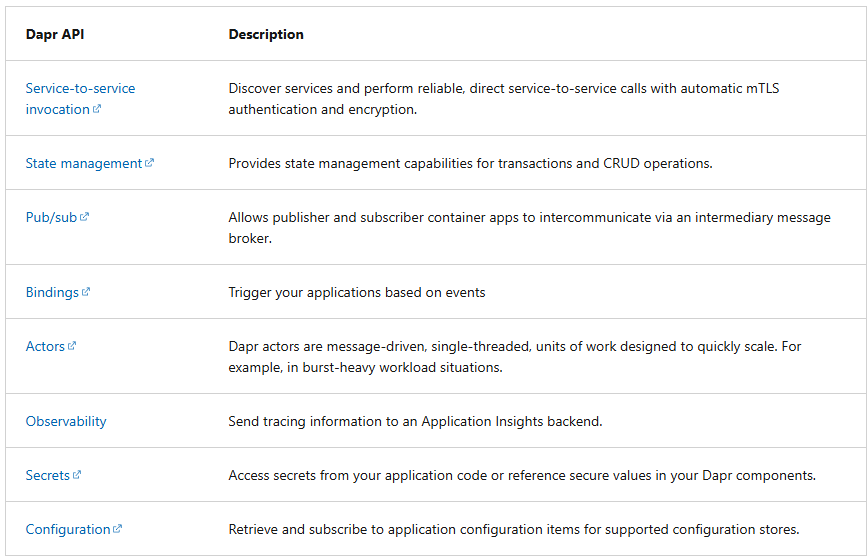

# Azure Container Apps (ACA)
- Azure Container Apps is a serverless platform built on Azure Kubernetes Service (AKS) for running microservices and containerized applications.
- Common use cases:
  - Deploying API endpoints
  - Hosting background processing applications
  - Handling event-driven processing
  - Running microservices
- Apps on Azure Container Apps can dynamically scale based on HTTP traffic, event-driven-processing, CPU or memory load and more.
- Azure Container Apps feature:
  - Run multiple container revisions – Manage different versions of your app.
  - Autoscaling
  - Built-in HTTPS ingress – No need to manage extra Azure infrastructure.
  - Split traffic across multiple versions
  - Internal service discovery – Secure internal endpoints with DNS-based service discovery.
  - Dapr integration – Build microservices with Dapr APIs.
  - Run containers from any registry, public or private, including Docker Hub and Azure Container Registry (ACR).
  - Use the Azure CLI extension, Azure portal or ARM templates to manage your applications.
  - Attach an existing VNet to your container environment.
  - Securely manage secrets directly in your application.
  - Monitor logs using Azure Log Analytics.

### Azure Container Apps Environment
- Secure boundary – Groups container apps together in a secure environment.
- Shared Virtual Network – All container apps in the same environment use the same VNet.
- Unified Logging – Logs from all container apps go to the same Azure Log Analytics workspace.
- Custom VNet Support – You can provide an existing virtual network when creating the environment.


| Deploy Container Apps to same environment               | Deploy Container Apps to different environment                 |
|---------------------------------------------------------|----------------------------------------------------------------|
| Manage related services                                 | Isolate compute resources between applications.                |
| Use the same virtual network for multiple applications. | Prevent Dapr applications from communicating with each other.  |
| Enable Dapr service invocation between apps.            |                                                                |
| Share the same Dapr configuration.                      |                                                                |
| Send logs to the same Log Analytics workspace.          |                                                                |


### Microservices with Azure Container Apps
Azure Container Apps is ideal for microservices because it supports:

- `Independent scaling, versioning, and upgrades` – Each service can scale separately without affecting others.
- `Service discovery` – Microservices can easily find and communicate with each other.
- `Native Dapr integration` – Simplifies communication, state management, and event-driven processing.

This makes it easier to build, manage, and scale microservices efficiently.

### Dapr integration
Dapr (Distributed Application Runtime) enhances microservices by handling:

- Service-to-service invocation – Secure, reliable communication with retries and mutual TLS.
- Observability – Built-in monitoring for better insights.
- Pub/Sub messaging – Decouples services with event-driven communication.
- State management – Stores data across distributed systems.

Using Dapr with Azure Container Apps simplifies microservices development, making apps more resilient and scalable.

# Authentication and authorization in ACA
- Built-in authentication/authorization
- Access to various built-in authentication providers
- Only want to use HTTPS? Disable `allowInsecure`

### Identity providers
- Microsoft Identity Platform
- Facebook
- GitHub
- Google
- X
- Any OpenID Connect provider

### Authentication flow
1. `Without provider SDK` (server-directed flow):
- The container app delegates the sign-in process to the identity provider.
- This flow is common for browser-based applications.
- The user is redirected to the provider’s sign-in page, where they authenticate. Once authenticated, the provider redirects the user back to the app with an authentication token.
2. `With provider SDK` (client-directed flow):
- In this flow, the app itself handles the authentication, often without redirecting the user to the provider’s sign-in page.
- The app uses the provider’s SDK to sign in the user and then sends the authentication token to Container Apps for validation.
- This is typically used in apps like mobile apps or other browser-less applications.


# Manage revisions and secrets in Azure Container Apps
Azure Container Apps uses revisions to manage container app versioning. A revision represents an immutable snapshot of a specific version of your app
- Revisions are automatically created whenever you make updates that affect the container app (e.g., code updates, configuration changes).
- Each revision can be deployed independently, allowing you to manage multiple versions of your app.
- If you need to roll back to a previous version, you can simply revert to an earlier revision.

### Secrets
Azure Container Apps allows you to securely store secrets and make them available to your containerized applications. Here's how secrets work:
- Secrets are scoped to an application, outside any specific revision of an application.
- Each application revision can reference one or more secrets.
- Modifying secrets does not generate a new revision.
- Multiple revisions can reference the same secrets.

An updated or deleted secret doesn't automatically affect existing revisions in your app. When a secret is updated or deleted, you can respond to changes in one of two ways:

1. Deploy a new revision.
2. Restart an existing revision.

Before you delete a secret, deploy a new revision that no longer references the old secret. Then deactivate all revisions that reference the secret.

### Defining secrets
- Use `--secrets` keyword to define a secret
- To reference a secret in an env variable; Use `secretref:<secret_name>` 
- for example: 
 ```bash
  -secrets "queue-connection-string=$CONNECTIONSTRING" \
  --env-vars "QueueName=myqueue" "ConnectionString=secretref:queue-connection-string"
```

# Explore Dapr integration with Azure Container Apps
- Distributed Application Runtime
- Set of tools that makes it easier to build and manage microservices. Dapr provides capabilities for enabling application intercommunication through messaging via pub/sub or reliable and secure service-to-service calls.

### Dapr API


### Configure dapr in Azure Container Apps
- Container Apps CLI
- Infrastructure as Code (IaC) templates, as in Bicep or Azure Resource Manager (ARM) templates
- Azure Portal

