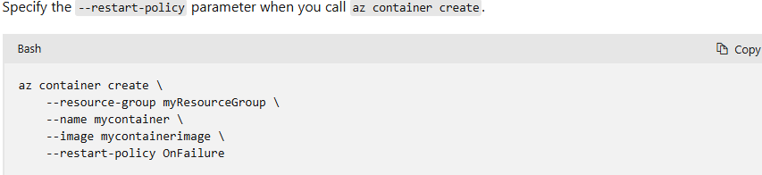

# Azure Container Instance (ACI)
Azure Container Instances (ACI) is ideal for running isolated containers in scenarios like simple apps, automation, or build jobs. Key benefits include:

- `Fast startup`: Launch containers in seconds without managing VMs.
- `Container access`: Assign an IP address and domain name (FQDN) to your containers.
- `Hypervisor-level security`: Containers are as isolated as in a VM.
- `Custom data`: ACI only stores minimal customer data necessary to keep your container groups running
- `Custom sizes`: Specify exact CPU and memory for optimal use.
- `Persistent storage`: Use Azure Files to store and retrieve data.
- `Linux and Windows support`: Run both OS types using the same API.

For full container orchestration (e.g., scaling, upgrades, and multi-container management), consider Azure Kubernetes Service (AKS).

### Container groups: top level resource in ACI
- Collection of containers on the same host machine
- The containers in the group shares the same 
  - lifecycle
  - resources
  - local network
  - storage volumes.

### Deployment
To deploy a multi-container group, use `Resource Manager template` or `YAML`
<br>Resource manager template is recommended when you need to deploy more Azure service resource(for example, Azure Files share)
<br> YAML is recommended when you only use container instances

### Resource allocation
Azure Container Instances allocate resources like CPUs, memory, and optional GPUs to a container group by summing up the resource requests of all containers in the group. 
<br>For example, a container group with two containers, each requesting 1 CPU, will be allocated 2 CPUs.

### Networking
In ACI, all containers in a container group share the same IP address and port namespace. Here's how it works:

- To allow external access to a container in the group, you must expose its port on the shared IP address and within the container itself.
- Port mapping isn't supported because all containers share the same port namespace.
- Containers in the group can communicate with each other using localhost and the ports they've exposed, even if those ports aren't externally accessible.

### Storage
You can attach external volumes to a container group in ACI and map them to specific paths inside individual containers. Supported volume types include:
- Azure file share
- Secret
- Empty directory
- Cloned git repo

### Common scenarios for when to use multi-container groups
Multi-container groups in ACI let you split a task across multiple containers with specific roles and resource needs.
<br> Example:
1. Web and Content Pulling: One container serves a web app, while another fetches fresh content from source control.
2. Application and Logging: The app container runs the main app, while the logging container captures logs and metrics for long-term storage.
3. Application and Monitoring: A monitoring container periodically checks the app's health and raises alerts if it fails.
4. Front-End and Back-End: A front-end container serves the web app, and a back-end container handles data retrieval.

# Run containerized tasks with restart policies
You can set a restart policy to ensure containers stop after finishing their tasks. Since ACI bills per second, 
you're only charged for the time the container is actively running.

| Restart policy | Description                                                                                          |
|----------------|------------------------------------------------------------------------------------------------------|
| Always         | Containers restart automatically after stopping. <br/>This is the default if no policy is specified. |
| Never          | Containers run only once and never restart, regardless of success or failure.                        |
| OnFailure      | Containers restart only if they fail (terminate with a nonzero exit code). They run at least once.   |


ACI sets the container's status to Terminated when the container stops. This happens in the following cases:
- Restart policy is Never: The container stops after completing its application or script.
- Restart policy is OnFailure: The container stops after running its application or script and doesn't restart if it completes successfully.



# Set environment variables in container instances

### Secure values
Secure environment variables are used to store sensitive data, like passwords or keys, securely in Azure Container Instances. Key points:
- Security: Secure variables are safer than hardcoding sensitive information into a container's image.
- Visibility: Secure values are not visible in the container's properties (e.g., in the Azure Portal or CLI). Only their names are displayed.
- Access: Secure values are accessible only within the container itself.

YAML example:
```yaml
environmentVariables:
  - name: REGULAR_VAR
    value: regular_value
  - name: SECURE_VAR
    secureValue: sensitive_value
```

# Mount an Azure file share in Azure Container Instances
Azure Container Instances are stateless by default, 
meaning any data inside the container is lost when it stops or crashes. 
To persist data:
- Mount a Volume: Attach an external storage volume to the container.
- Azure Files: Use an Azure file share as the external storage. Azure Files is a fully managed, cloud-based file-sharing service that supports the SMB protocol.

### Limitations
- Linux-only: Azure Files can only be mounted to Linux containers.
- Root Requirement: The Linux container must run as root to mount the Azure file share.
- CIFS-only: Azure File share volume mounts are limited to the CIFS (SMB) protocol.