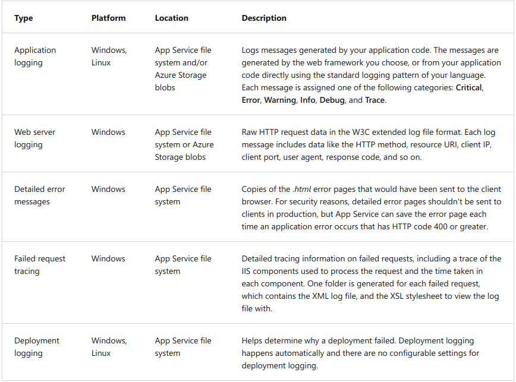
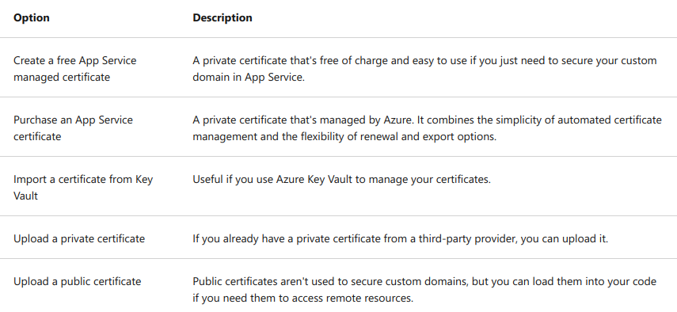
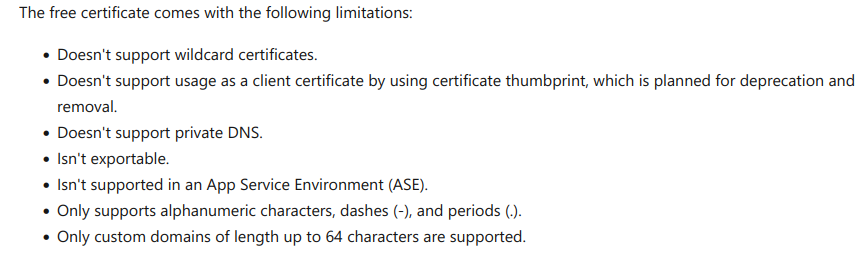
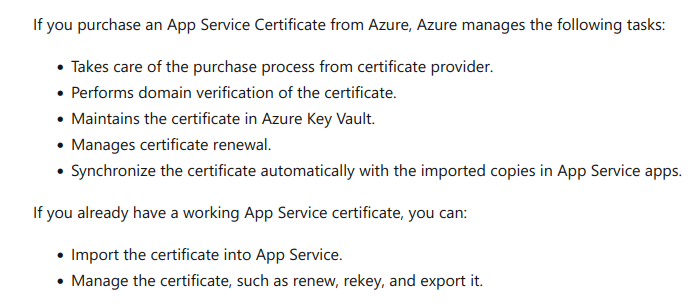

`Logging`:
https://learn.microsoft.com/en-us/training/modules/configure-web-app-settings/5-enable-diagnostic-logging

`Security`:
Options for adding certificate to app service:

- Private certificate requirements:
  - Exported as a password-protected PFX file, encrypted using triple DES.
  - Contains private key at least 2048 bits long.
  - Contains all intermediate certificates and the root certificate in the certificate chain.

