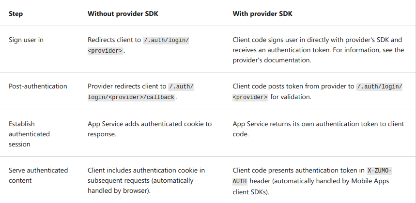

`Azure App Service`: HTTP-based service for hosting web apps, REST API, mobile back ends.
- Linux/Windows. Linux has some limitations.
- Multiple programming language options.
- Built-in auto scale. increase/decrease resources
- Container support: Azure Container Registry / Docker Hub
- CI/CD support
- Deployment slots: For Standard App Service Plan or higher. Basically environments / profiles (production, staging, development)
  - Swappable deployment slots.
    
 

`Azure App Service plans`:
- A plan defines:
  - OS (Windows, Linux)
  - Region (West US, East US)
  - Number of VM instances
  - VM size (small, medium, large)
  - Pricing Tier
- `Pricing Tier`: determines what features to get
  - Shared tier (free and shared): `Cannot scale`
  - Dedicated (Basic, Standard, Premium, PremiumV2, PremiumV3) `Runs apps on dedicated Azure VM`
  - Isolated (Isolated, IsolatedV2) `Runs dedicated Azure VM on dedicated Azure Virtual Networks`

 

`Deploy to App Service`
- `Automated` deployment sources:
  - GitHub
  - Bitbucket
  - Azure DevOps Services
- `Manual` deployment:
  - Git: Git URL from remote repository can be pushed to App Service
  - CLI: packages and deploy your app. `az webapp up` for example
  - Zip deploy: curl or other HTTP utility to send ZIP of application files to App Service
  - FTP/S

 

`Authentication and Authorization in App Service`
- Provides built-in authentication and authorization support.
- Logging
- Token store: Built into App Service.
  - Repository of tokens associated with users of your web apps, APIs or mobile apps.
- Integrate with multiple `identity providers`:
  - Microsoft identity platform
  - Facebook
  - Google
  - X
  - Any OpenID Connect provider
  - GitHub
- `Authentication flow`:

  

`App Service networking features`:
- App Service Deployments Types:
  - Multi-tenant:
    - Shared infrastructure with other customers
    - Apps are hosted in shared network, but isolated from others
    - Roles:
      - front ends: Handle incoming HTTP/S
      - workers: run your app
  - Single-tenant:
    - Dedicated infrastructure for 1 customer
    - Used by App Service Environment (ASE) with isolated SKU
    - Directly hosted in VNet
- App Service provides:

| Inbound features (traffic to app)              | Outbound features (traffic from app) |
|------------------------------------------------|--------------------------------------|
| App assigned address (fixed IP-address)        | Hybrid connection                    |
| Access restrictions (blocks/allows certain IP) | Gateway-required VNet integration    |
| Service endpoints                              | VNet integration                     |
| private endpoints                              |                                      |

