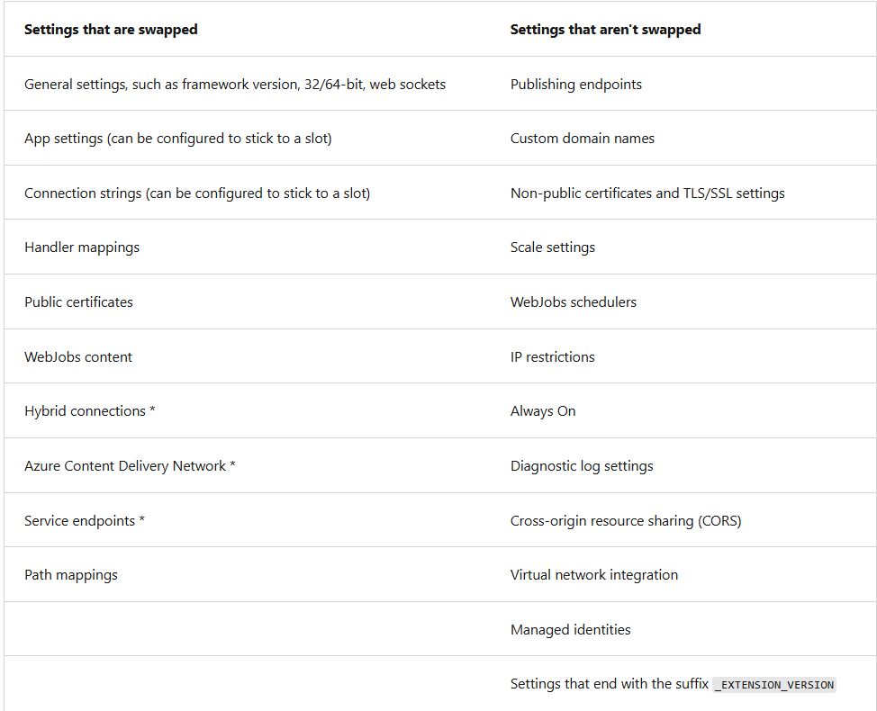

# Explore Staging environments
- Deploying to a non-production slot benefits:
  - Validate app changes
  - All instances are warmed up before being swapped to production. No downtime when swapping to production.
  - You can swap back if the new change isnt working properly.
- No extra charge for using slots.

# Slot swapping 
Any operations happen on source slots and not the target slots.
1. Apply production settings to staging
   - Copy the settings from production to staging:
     - App settings and connection string, if applicable.
     - Continuous deployment settings, if enabled
     - Authentication settings, if enabled
   - These cases trigger a restart of all staging slot instances
2. Wait for restart is complete. If any instance fail to restart. Revert swap operation.
3. If local cache enabled
   - Trigger cache initialization by making HTTP requests to app's root ("/")
4. If auto swap with custom warm-up is enabled
   - trigger Application Initiation by making using HTTP requests to app root ("/")
     - If **applicationInitialization** isn't specified, trigger HTTP request to the app root of source slot on each instance.
     - If instance returns HTTP response, it's considered to be warmed up.
5. Swap Slots
6. Restart Old Production (Now Staging)
   - Apply the same settings and restart the instances in old production slot.

Settings that are (not) swapped:

# Route traffic
- Functionality to route % clients to your staging URL. Can be useful for some beta features.
- To go back to production. Add to url `/?x-ms-routing-name=self"`
- To go to beta. Add to url: `/?x-ms-routing-name=MyCustomStagingSlot`