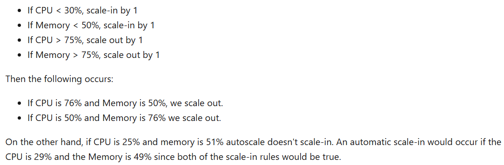

# Autoscaling:
- Adjust available resources based on current demand.
- Triggered by a schedule or when resource is low e.g. CPU usage grows / memory occupancy increase / more incoming requests.

Scale out options:
1. `Azure autoscale`
- Use rules. for example: 
  - Add another web server if CPU > 70% for 10 min. 
  - Remove if CPU < 40% for 15 min.
- Autoscaling doesn't have any effect on the CPU power, memory, or storage. It only changes the number of web servers / instances.
- Improves elasticity (for example increased/reduced activity during holidays)
- Improves availability and fault tolerance

2. `Azure App Service automatic scaling`
- No need to manually create rules. Azure does it.

# Autoscale factors
1. Scale based on `metrics` (number of http requests, disk queue length)
2. Scale based on `schedule` (Every day at 8 - 10 am)
- Metrics for autoscale rules for web app:
  - CPU %
  - Memory %
  - Disk Queue Length
  - Http Queue Length
  - Data in (number of bytes received)
  - Data out (number of bytes sent)

# Autoscale actions
- example: scale-out (add) / scale-in (remove) instance if CPU % reach a threshold
- It uses operators:
  - Greater than
  - Less than
  - Equal to
- Cooldown period

# Autoscale conditions:
- Can contain multiple rules for scaling in/out
- `scaling out (add)`: If any rule is true -> perform action.
  - If HTTP queue length > 10, add 1 instance. `Or` if CPU > 70%, add 1 instance.
  - To make scale-in work with any single rule, define separate conditions for each rule.
- `scaling in (remove)`: All rules must be true -> perform action
  - If HTTP queue length = 0 `and` CPU < 50%, remove 1 instance.

# Best practice
- `diagnostics metric types`: 
  - Average
  - Minimum
  - Maximum
  - Total
- Different max and min values with adequate margin between them. `not this`:
  - minimum=two, maximum=two
- Scale out/in must have difference values. `not this`:
  - Increase instances by one count when Thread Count >= 600
  - Decrease instances by one count when Thread Count <= 600
- Always select a default instance count
- Configure autoscale notifications
