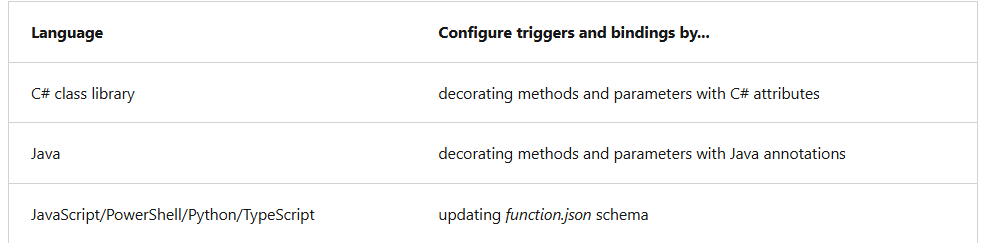
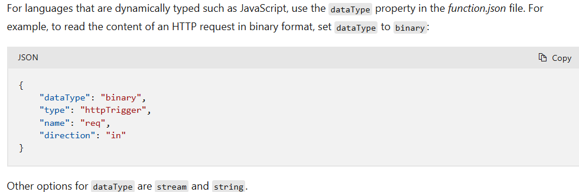
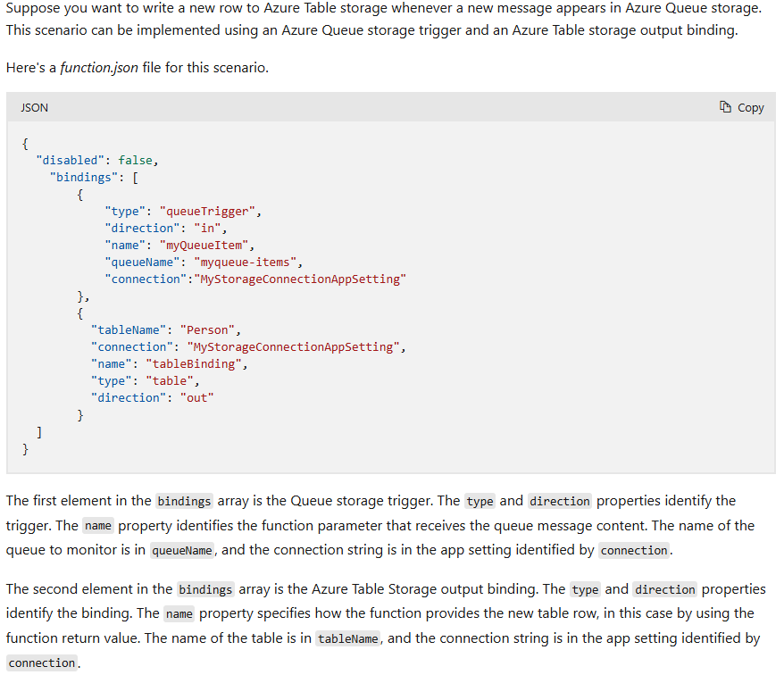
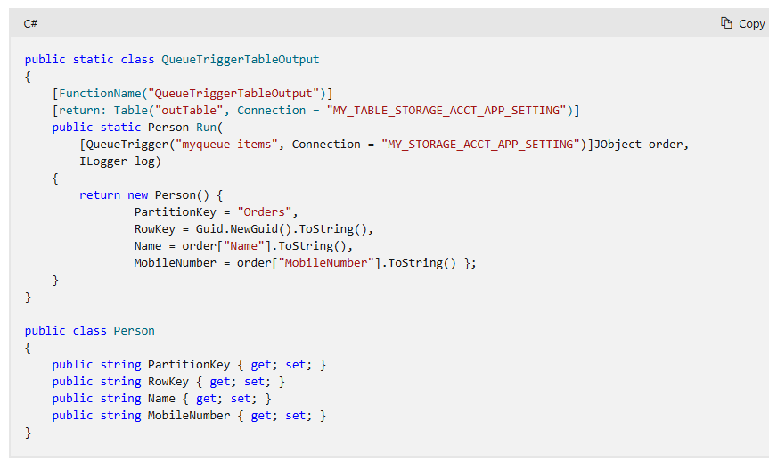

> For practice: create a function in Java and C# locally and publish to Azure.

`Function app`: execution context in Azure where your functions run.
- One or more individual functions
- Manage, Deploy and scale functions together
- All functions in function app share same pricing plan, deployment method and runtime version.

### Develop and test Functions locally
- You can use your code editor and dev tools to create / test functions on your local computer.
- Your local functions can connect to live Azure services.

### Local project files
- All functions project directory (regardless of language) contains:
  - `host.json`:
    - Metadata file: Config options that affect all functions in function app
    - Other function apps configs are managed in:
      - Function App in Azure? -> application settings
      - Function App in local computer? -> local.settings.json
  - `local.settings.json`
    - Stores settings and settings used by local dev tools.
    - Settings only used when project is running locally
  - Other project files depended on language and specific functions.

### Synchronize settings from local to Azure
- Publish from local to Azure? Dont forget to add settings from local to  app settings for function app
- `local.settings.json` may contains secrets, such as connString. Never store in remote repo.

# Triggers and bindings
- `Trigger`:
  - How is a function invoked
  - Function must have exactly 1 trigger
  - triggers have data(payload)
- `bindings`:
  - Connect a resource to a function
  - input/output bindings or both
  - Data from binding are parameters for functions
  - Bindings are optional
  - Bindings can be mixed
  - A function can have 1+ input/output binding
  

- Triggers and bindings let you avoid hardcoding access to other services.

- Language that uses function.json, the portal provides UI for adding bindings in the **Integration tab**
- Java and C# cannot use azure portal editing

### Binding direction
- All triggers and bindings have direction in `function.json`
- For triggers. The direction is `in`
- For input/output bindings use `in` and `out`

### Function.json Example

### C# Example

