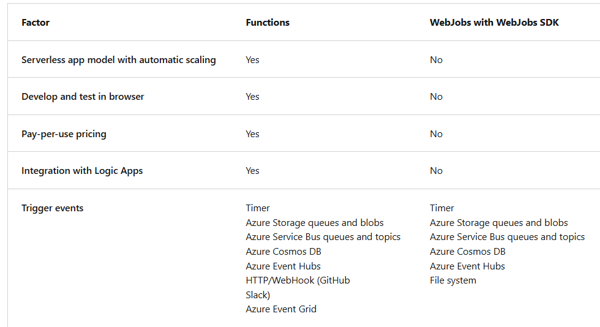

# Azure Functions
`Azure Functions`: serverless solution. Write less code, maintain less infrastructure and save on cost. 
No need to worry about deploying and maintaining servers.
- Good as event triggers
- `triggers`: ways to start execution of code
- `bindings` ways to simplify coding for input/output data

Both Azure Functions and Azure Logic apps are services that enable serverless workloads.
- Function: serverless compute service
- Logic Apps: serverless workflow integration platform
- `orchestrations`: collection of functions

Functions VS Logic Apps

Functions VS WebJobs with WebJobs SDK

- Functions & WebJobs are code-first (imperative) development model.
- Logic Apps are designer-first (declarative) development model

# Hosting options
`Consumption plan`:
- default
- pay as you go with automatic scale
- instances of the Functions host are dynamically added / removed based on the number of incoming events.

`Flex Consumption plan`:
- High scalability with compute choices
- VNet
- Pay as you go
- instances of the Functions host are dynamically added / removed based on the configured per instance concurrency and the number of incoming events.
- Can reduce cold starts by specifying number of pre-provisioned (always ready) instances.
- Scales automatically

`Premium plan`:
When to use?:
- Scales based on prewarmed workers. Run app with no delay after being idle
- Function apps run continuously, or nearly continuously.
- Want more control of your instances and want to deploy multiple function apps on the same plan with event-driven scaling.
- Have a high number of small executions and a high execution bill, but low GB seconds in the Consumption plan.
- Need more CPU or memory options than are provided by consumption plans.
- Code needs to run longer than max execution time allowed on the Consumption plan.
- Requires VNet connectivity.
- Need custom Linux image

`Dedicated plan`:
When to use?
- Best for long-running scenario's where Durable Functions cannot be used
- Have fully predictable billing, or need to manually scale instances.
- Want to run multiple web apps and function apps on the same plan
- Need access to larger compute size choices.
- Full compute isolation and secure network access provided by an App Service Environment (ASE).
- High memory usage and high scale (ASE).
- Need Linux

`Container apps`:
When to use?
- Want to package custom libraries with your function code to support line-of-business apps.
- Need to migrate code execution from on-premises or legacy apps to cloud native microservices running in containers.
- Want to avoid the overhead and complexity of managing Kubernetes clusters and dedicated compute.
- Need the high-end processing power provided by dedicated CPU compute resources for your functions.

# Function app timeout duration
The `functionTimeout` property in the host.json project file specifies the timeout duration for functions in a function app.

# Scaling

